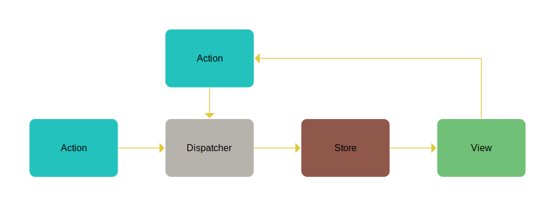

Shadow-Flux is an implementation of Facebook's FLux pattern. It is simple to understand and to use.

Introduction
===
First, let's present the different elements:




|||
|--|--|
|`Action`|It allows to specify a change through the `Dispatcher`.|
|`Dispatcher`| It allows to manage all the change requests, and forwards the requests to the `Stores`.|
|`Stores`| Process change requests and update their data model|
|`Views`|These are React components that will update their display according to the new state of the `Stores` data model.|

<hr />
<br />

## Action
An `Action` represents the element by which a change will take place. This action has at least one piece of information, its type. 
The type is the only field required to identify an action. It is possible to complete an action by adding as much information as necessary.

At a minimum, an action can be represented as follows:

### _Typescript_ :
```typescript
// Action type
type Action = {
  type: string;
}

// Sample action
const action = {
  type: "myAction"
} as Action;
```

### _Javascript_ :
```javascript
const action = {
  type: "myAction"
}
```

An action is therefore determined by its type, and the additional fields will allow `Stores` to process the action in the best way.

For example imagine that we wanted to obtain the price of a plane trip, we will have at our disposal the airport of departure, arrival, the number of passengers, and the date of departure. Our Action could be defined as follows:

```typescript
type GetTripPriceAction = {
  type        : "GetTripPriceAction" ;
  numberOfPax : number               ;
  departure   : string               ;
  arrival     : string               ;
}
```